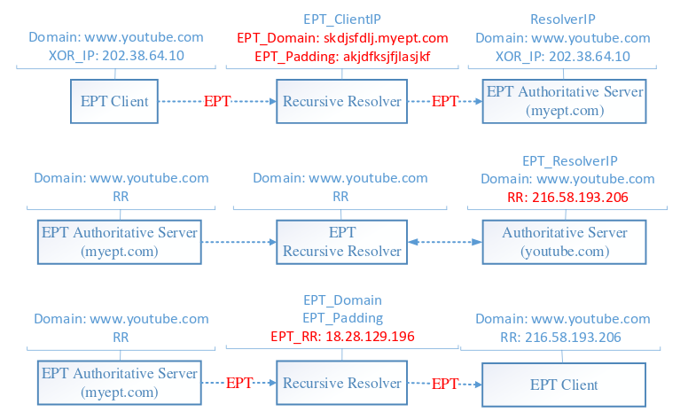

# dns_test_ept
A Public Key based EDNS Privacy Tunnel for DNS，隐私扩展

# Background

EPT takes advantage of the public key encryption to hide the query domain from recursive resolvers, reduce the client IP leakage to authoritative server, defense against censorship and lying recursive resolvers.

# Install
 
    # install
    $ cpan App::cpanminus
    $ cpanm -n Net::DNS Net::DNS::Nameserver Net::DNS::Resolver Crypt::PK::RSA MIME::Base32 IP::Random String::Random Digest::MD5

    # generate rsa1024 key pair
    $ cd dns_test_ept/key
    $ ./generate_key.sh

# run local_ept_recur
    
local_ept_recur listen on 127.0.0.1:52000, send the query to relay_resolver 127.0.0.1:53000

    $ cd dns_test_ept
    $ perl 01.local_ept_recur.pl

# run relay_resolver

relay_resolver listen on 127.0.0.1:53000, it is an recursive resolver, we simplify it only to ept_domain's auth

    $ cd dns_test_ept
    $ perl 02.relay_resolver.pl

# run remote_ept_auth

ept auth listen on 127.0.0.1:54000, send the query to its own recursive resolver 127.0.0.1:53

    $ cd dns_test_ept
    $ perl 03.remote_ept_auth.pl

# client test

    $ dig @127.0.0.1 -p 52000 www.youtube.com

    ; <<>> DiG 9.11.2 <<>> @127.0.0.1 -p 52000 www.youtube.com
    ; (1 server found)
    ;; global options: +cmd
    ;; Got answer:
    ;; ->>HEADER<<- opcode: QUERY, status: NOERROR, id: 28785
    ;; flags: qr aa rd; QUERY: 1, ANSWER: 6, AUTHORITY: 0, ADDITIONAL: 1
    ;; WARNING: recursion requested but not available

    ;; OPT PSEUDOSECTION:
    ; EDNS: version: 0, flags:; udp: 4096
    ; COOKIE: 7513a1bca096da7c (echoed)
    ;; QUESTION SECTION:
    ;www.youtube.com.		IN	A

    ;; ANSWER SECTION:
    www.youtube.com.	136	IN	A	74.125.203.100
    www.youtube.com.	136	IN	A	74.125.203.102
    www.youtube.com.	136	IN	A	74.125.203.101
    www.youtube.com.	136	IN	A	74.125.203.138
    www.youtube.com.	136	IN	A	74.125.203.139
    www.youtube.com.	136	IN	A	74.125.203.113

    ;; Query time: 13 msec
    ;; SERVER: 127.0.0.1#52000(127.0.0.1)
    ;; WHEN: 日 10月 15 15:19:55 CST 2017
    ;; MSG SIZE  rcvd: 152

## local_ept_recur

    ----local_ept_recur----
    recv from client: www.youtube.com
    send to relay_resolver: qname 1ab0a5a592f51bbc9ae4f633517b46ad.eptfortest.com, xor_ip 160.187.191.182
    recv from relay_resolver: 1ab0a5a592f51bbc9ae4f633517b46ad.eptfortest.com. 136 IN A 234.198.116.210
    send to client: www.youtube.com. 136 IN A 74.125.203.100
    recv from relay_resolver: 1ab0a5a592f51bbc9ae4f633517b46ad.eptfortest.com. 136 IN A 234.198.116.208
    send to client: www.youtube.com. 136 IN A 74.125.203.102
    recv from relay_resolver: 1ab0a5a592f51bbc9ae4f633517b46ad.eptfortest.com. 136 IN A 234.198.116.211
    send to client: www.youtube.com. 136 IN A 74.125.203.101
    recv from relay_resolver: 1ab0a5a592f51bbc9ae4f633517b46ad.eptfortest.com. 136 IN A 234.198.116.60
    send to client: www.youtube.com. 136 IN A 74.125.203.138
    recv from relay_resolver: 1ab0a5a592f51bbc9ae4f633517b46ad.eptfortest.com. 136 IN A 234.198.116.61
    send to client: www.youtube.com. 136 IN A 74.125.203.139
    recv from relay_resolver: 1ab0a5a592f51bbc9ae4f633517b46ad.eptfortest.com. 136 IN A 234.198.116.199
    send to client: www.youtube.com. 136 IN A 74.125.203.113
    ----end----

## relay_resolver

    ----relay_resolver----
    this is a recursive resolver
    find 1ab0a5a592f51bbc9ae4f633517b46ad.eptfortest.com 's authority server, then send the query
    reply: 1ab0a5a592f51bbc9ae4f633517b46ad.eptfortest.com. 136 IN A 234.198.116.210
    reply: 1ab0a5a592f51bbc9ae4f633517b46ad.eptfortest.com. 136 IN A 234.198.116.208
    reply: 1ab0a5a592f51bbc9ae4f633517b46ad.eptfortest.com. 136 IN A 234.198.116.211
    reply: 1ab0a5a592f51bbc9ae4f633517b46ad.eptfortest.com. 136 IN A 234.198.116.60
    reply: 1ab0a5a592f51bbc9ae4f633517b46ad.eptfortest.com. 136 IN A 234.198.116.61
    reply: 1ab0a5a592f51bbc9ae4f633517b46ad.eptfortest.com. 136 IN A 234.198.116.199
    ----end----

## remote_ept_auth

    ----remote_ept_auth----
    recv from relay_resolver: 1ab0a5a592f51bbc9ae4f633517b46ad.eptfortest.com
    decrypt ept data: www.youtube.com, xor_ip 160.187.191.182
    send query to ept_own_resolver: www.youtube.com
    recv from ept_own_resolver: www.youtube.com. 56747 IN CNAME youtube-ui.l.google.com.
    recv from ept_own_resolver: youtube-ui.l.google.com. 856 IN CNAME youtube-ui-china.l.google.com.
    recv from ept_own_resolver: youtube-ui-china.l.google.com. 136 IN A 74.125.203.100
    send to relay_resolver: 1ab0a5a592f51bbc9ae4f633517b46ad.eptfortest.com. 136 IN A 234.198.116.210
    recv from ept_own_resolver: youtube-ui-china.l.google.com. 136 IN A 74.125.203.102
    send to relay_resolver: 1ab0a5a592f51bbc9ae4f633517b46ad.eptfortest.com. 136 IN A 234.198.116.208
    recv from ept_own_resolver: youtube-ui-china.l.google.com. 136 IN A 74.125.203.101
    send to relay_resolver: 1ab0a5a592f51bbc9ae4f633517b46ad.eptfortest.com. 136 IN A 234.198.116.211
    recv from ept_own_resolver: youtube-ui-china.l.google.com. 136 IN A 74.125.203.138
    send to relay_resolver: 1ab0a5a592f51bbc9ae4f633517b46ad.eptfortest.com. 136 IN A 234.198.116.60
    recv from ept_own_resolver: youtube-ui-china.l.google.com. 136 IN A 74.125.203.139
    send to relay_resolver: 1ab0a5a592f51bbc9ae4f633517b46ad.eptfortest.com. 136 IN A 234.198.116.61
    recv from ept_own_resolver: youtube-ui-china.l.google.com. 136 IN A 74.125.203.113
    send to relay_resolver: 1ab0a5a592f51bbc9ae4f633517b46ad.eptfortest.com. 136 IN A 234.198.116.199
    ----end----
